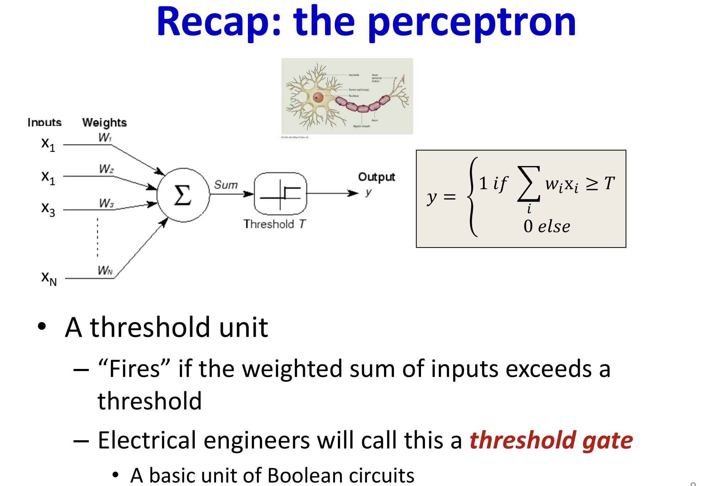

---
---

---
---
# Universal approximation function
> It is not clear that the great number of regions is an advantage unless (i) there are similar symmetries in the real-world functions that we wish to approximate or (ii) we have reason to believe that the mapping from input to output really does involve a compoosite of simpler functions
# Why deep NNs are preferred over shallow NNs
> Roughly speaking, for the shallow networks, if one increase neurons by K, they introduce K more kinks for a one dimension input; however, when they introduce K more neurons with one more hidden layer, they introduce K^2-K more kinks. Simple example: 6 neurons in a 1d input shallow NNs, it has 6+1 kinks; for a two-hidden-layers NN which has 3 neurons each layer (6 in total), it will introduce (3+1)^2(layers) kinks

> This phenomenon is referred to as **depth efficiency** of NNs. This property is also attractive, but it is not clear that the real-world functions that we want to approximate fall into this category.

> Deep NNs seem to be ease of fitting. It's <u>maybe</u> that over-parameterized deep models have a large family of roughly equivalent solutions that are easy to find. However, as we add more hidden layers, training becomes more difficult again. 

> DNNs also seem to generalize to new data better. In practice, the best results for most tasks have been achieved using networks with tens or hundreds of layers.
